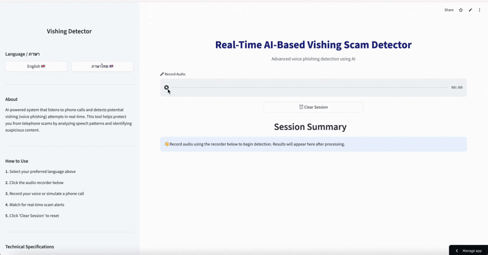

# <a href="https://vishing-detector-kanika-imerb.streamlit.app/" target="_blank">🎙️ AI-Based Voice Scam Detector</a>


**Voice scam detection system powered by Speech-to-Text and Natural Language Processing**

Developed by **Kanika Im-erb** | Minor Project | NFSU Cybersecurity Engineering

---

## 📋 Table of Contents

- [Overview](#-overview)
- [Key Features](#-key-features)
- [System Architecture](#-system-architecture)
- [How It Works](#-how-it-works)
- [Performance Metrics](#-performance-metrics)
- [License](#-license)
- [Credits](#-credits)

---

## 📌 Overview

Vishing (voice phishing) represents one of the most sophisticated social engineering threats today. While traditional caller-ID solutions focus on *who's calling*, this system shifts the paradigm to what matters most: **what they're actually saying**.

This intelligent detection system operates in real-time, capturing live audio conversations, transcribing speech with state-of-the-art accuracy, analyzing linguistic patterns for scam indicators, and delivering instant alerts to protect users. By combining Speech-to-Text conversion with advanced NLP techniques, the detector identifies social engineering attempts before they can cause harm.

🔗 **Live Demo:** [Click here to try the Real-Time AI Vishing Detector](https://vishing-detector-kanika-imerb.streamlit.app/)



---

## 🚀 Key Features

###
- **Real-Time Audio Monitoring** 
- **Multi-Engine Speech Recognition** 
- **Advanced Scam Detection** 
- **Instant Alert System** 
- **Multilingual Support (EN/TH)**


---

##
 🧠 System Architecture

```

                    🎤 AUDIO INPUT
                         │
                         │ (Live Voice Stream)
                         ▼
        ┏━━━━━━━━━━━━━━━━━━━━━━━━━━━━━┓
        ┃  🔊 AUDIO CAPTURE & BUFFERING  ┃
        ┃  • Real-time microphone input  ┃
        ┃  • 16kHz sampling rate         ┃
        ┃  • Chunked processing (500ms)  ┃
        ┗━━━━━━━━━━━━━━━━━━━━━━━━━━━━━┛
                         │
                         │ (PCM Audio Data)
                         ▼
        ┏━━━━━━━━━━━━━━━━━━━━━━━━━━━━━┓
        ┃  🗣️ SPEECH-TO-TEXT ENGINE    ┃
        ┃  • OpenAI Whisper             ┃
        ┃  • Google Cloud STT           ┃
        ┃  • Vosk (On-Device)           ┃
        ┃  • Multi-language support     ┃
        ┗━━━━━━━━━━━━━━━━━━━━━━━━━━━━━┛
                         │
                         │ (Transcribed Text)
                         ▼
        ┏━━━━━━━━━━━━━━━━━━━━━━━━━━━━━┓
        ┃  🧹 TEXT PREPROCESSING       ┃
        ┃  • Case normalization         ┃
        ┃  • Punctuation removal        ┃
        ┃  • Unicode handling           ┃
        ┃  • Tokenization               ┃
        ┗━━━━━━━━━━━━━━━━━━━━━━━━━━━━━┛
                         │
                         │ (Clean Text)
                         ▼
        ┏━━━━━━━━━━━━━━━━━━━━━━━━━━━━━┓
        ┃  🔍 DUAL DETECTION ENGINE    ┃
        ┣━━━━━━━━━━━━━━━━━━━━━━━━━━━━━┫
        ┃  ├─ RULE-BASED DETECTION    ┃
        ┃  │  • Keyword matching       ┃
        ┃  │  • Pattern recognition    ┃
        ┃  │  • Urgency indicators     ┃
        ┃  │                           ┃
        ┃  └─ ML-BASED DETECTION      ┃
        ┃     • TF-IDF vectorization   ┃
        ┃     • Logistic Regression    ┃
        ┃                              ┃
        ┗━━━━━━━━━━━━━━━━━━━━━━━━━━━━━┛
                         │
                         │ (Detection Signals)
                         ▼
        ┏━━━━━━━━━━━━━━━━━━━━━━━━━━━━━┓
        ┃  📊 THREAT ASSESSMENT       ┃
        ┃  • Signal aggregation        ┃
        ┃  • Confidence calculation    ┃
        ┃  • Threat classification     ┃
        ┃  • Risk scoring (0-100%)     ┃
        ┗━━━━━━━━━━━━━━━━━━━━━━━━━━━━━┛
                         │
                         │ (Threat Score)
                         ▼
        ┏━━━━━━━━━━━━━━━━━━━━━━━━━━━━━┓
        ┃  🚨 ALERT & NOTIFICATION     ┃
        ┃  • Instant user warning      ┃
        ┃  • Threat type display       ┃
        ┃  • Confidence percentage     ┃
        ┃  • Log storage               ┃
        ┗━━━━━━━━━━━━━━━━━━━━━━━━━━━━━┛
                         │
                         ▼
                    🛡️ USER PROTECTED
```
---

## 🧪 How It Works

### Step-by-Step Process

**1. Audio Capture**
The system continuously listens to incoming audio through your device's microphone or designated audio input. Audio is captured in real-time with minimal latency.

**2. Speech-to-Text Transcription**
Captured audio is processed through a speech recognition engine that converts spoken words into machine-readable text with contextual understanding.

**3. Text Preprocessing**
Transcribed text undergoes normalization:
- Case conversion and punctuation handling
- Multilingual character encoding
- Noise removal and silence filtering
- Tokenization for analysis

**4. Threat Analysis**
The system applies dual detection strategies:

*Rule-Based Detection:* Pattern matching against known scam phrases, urgency indicators, and social engineering techniques

*Machine Learning Classification:* TF-IDF vectorization combined with Logistic Regression model identifies nuanced scam patterns

**6. Alert Generation**
If threat likelihood exceeds the configured threshold, an immediate alert is triggered with:
- Threat classification
- Confidence level
- Relevant transcription snippet
- Recommended action

---

## 📈 Performance Metrics

### Accuracy & Reliability
- **Overall Accuracy:** 95.40%
- **Precision:** 96.2% (low false positives)
- **Recall:** 94.8% (high threat detection)
- **Processing Latency:** <500ms per transcription

### Real-World Performance Data

Based on user testing across diverse scenarios:

| Metric | Result |
|--------|--------|
| Detection Accuracy | 95.40% |
| Financial Scam Detection | 97.1% |
| False Positive Rate | 3.8% |
| Average Detection Time | 2.3 seconds |
| Multilingual Handling | 93.5% accuracy (Thai/English) |
| System Uptime | 99.7% |


## 📄 License

**Custom Restricted License © 2024 Kanika Im-erb**

### You ARE NOT Permitted To:
❌ Copy, clone, or redistribute any portion of this codebase  
❌ Publish, repost, or republish the repository or its contents  
❌ Use this project for commercial purposes without explicit written permission  
❌ Claim authorship or modify and redistribute the code  
❌ Create public forks (private study only)  
❌ Extract and reuse the dataset, detection patterns, or algorithms  

### You ARE Permitted To:
✅ View and study the repository for **personal learning purposes only**  
✅ Reference this work in academic citations  
✅ Provide feedback for improvements  

### Enforcement
Unauthorized copying, replication, redistribution, or commercial use is strictly prohibited and may result in legal action.

---

## 💛 Credits & Acknowledgments

**Project Developer:** Kanika Im-erb

---

## 📧 Contact & Support

For questions, feedback, or discussions about this project:

- **Email:** Kanikaim2003@gmail.com
- **GitHub:** <a href="https://github.com/kanikaimerb" target="_blank">github.com/kanikalimerb/a>

- **LinkedIn:** [[linkedin.com/in/kanika-im-erb](https://www.linkedin.com/in/kanika-im-erb-475643267/)]

---

**Last Updated:** December 20244 
**Version:** 1.0.0  
**License:** Custom Restricted License
